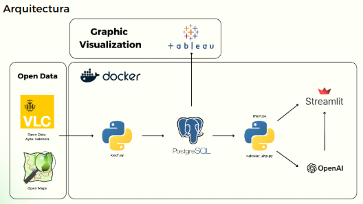
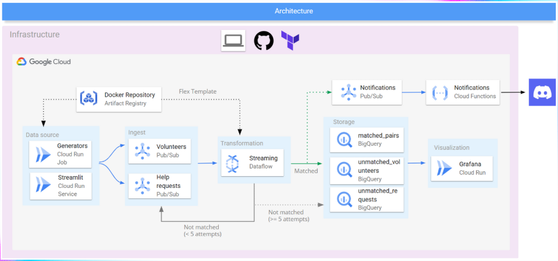
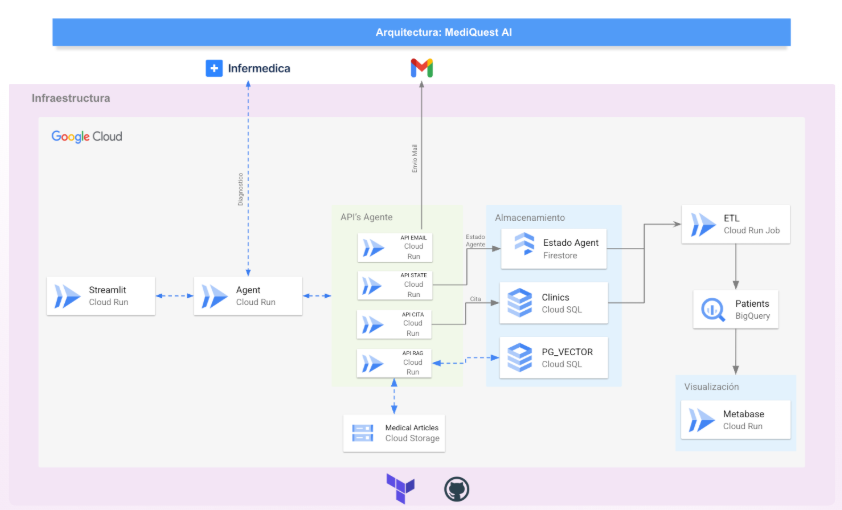

# 💼 DATA PROJECTS

This section showcases real-world projects developed during the Master’s in Big Data & Cloud at EDEM.  
Each challenge was designed to simulate industry scenarios — promoting hands-on learning, critical thinking, and cloud-native development.

Projects were delivered in collaborative teams, facing open-ended business cases that required scalable, automated, and well-justified solutions.

---

## 🧩 What These Projects Demonstrate

- Turning business needs into cloud-based technical architectures.  
- Selecting the right tools, services, and data models for the problem.  
- Automating and scaling workflows using Infrastructure as Code.  
- Communicating solutions clearly to both technical and non-technical stakeholders.  

---

## 📊 How Projects Were Evaluated

- **🧠 Business Value**: Creativity, relevance, clarity, and feasibility.  
- **⚙️ Technical Execution**: Architecture design, tool selection, implementation quality, and decision rationale.

---

## 🚀 Projects at a Glance

### 🛰️ [FindMyDistrict – District Recommender System](./DATA-PROJECT-1/)

**Use case**: Help citizens choose where to live in Valencia based on personal preferences like price, transport, green spaces, and services.  

**Solution**:  
A Streamlit-based app using the **Analytic Hierarchy Process (AHP)** for weighted recommendations. Interactive map and **Tableau dashboard** provide spatial and statistical insights.

- 🧠 AHP logic for multicriteria decision-making  
- 🗺️ Interactive district ranking map  
- 🐘 PostgreSQL + Docker backend for structured data  
- 📊 Tableau for housing and service analytics  

---

### 🌐 [Dana-Xarxa – Real-Time Emergency Aid Platform](./DATA-PROJECT-2/)

**Use case**: Support disaster response (DANA storms) by connecting citizens in need with volunteers in real time.

**Solution**:  
A serverless platform deployed on **GCP**, enabling real-time help requests, volunteer coordination, and data tracking. Fully managed with **Terraform**.

- ⚙️ Cloud Run, Pub/Sub, Dataflow, BigQuery, Cloud Functions  
- 🧩 Real-time communication and matching logic  
- 🔐 Docker + Artifact Registry for container lifecycle  
- 🔄 Infrastructure as Code for reproducibility  

---

### 🧠 [MediQuestAI – Backend & APIs for a Medical AI Assistant](./DATA-PROJECT-3/)

**Use case**: Reduce triage time and appointment management overhead in private clinics through automation and AI.

**Solution**:  
A cloud-native backend that integrates the **Infermedica API** to collect symptoms via chat, manages session state, and books appointments — always keeping the doctor in charge.

- 🧠 Symptom triage via Infermedica (RAG-enhanced, no diagnosis shown)  
- 📅 APIs for availability search, booking, confirmation, notifications, agent-state, RAG 
- 🧾 Status API to manage real-time user interactions  
- ☁️ GCP stack (Cloud Run, Firestore, BigQuery)  
- 📊 Dashboards in Metabase for bussines analytics  

---

🎯 *Each project reflects a key milestone in my path toward becoming a Data & Cloud Engineer — where business insight meets scalable, cloud-native execution.*
